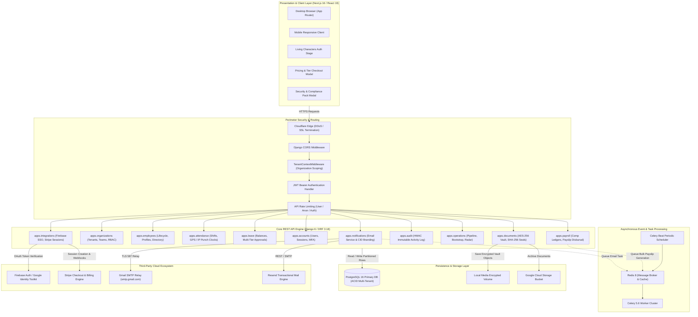
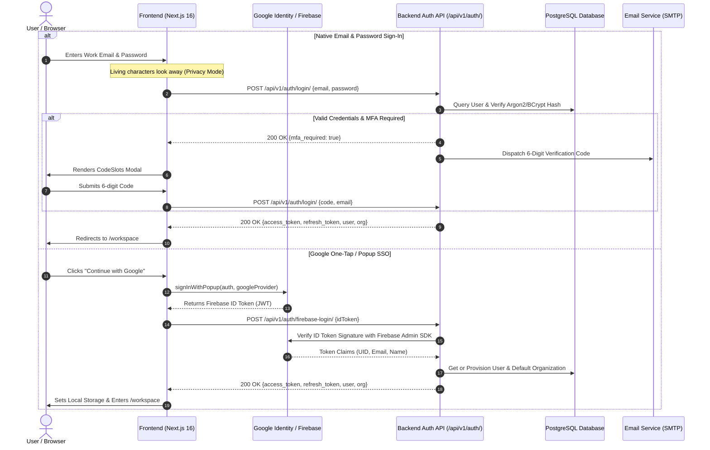
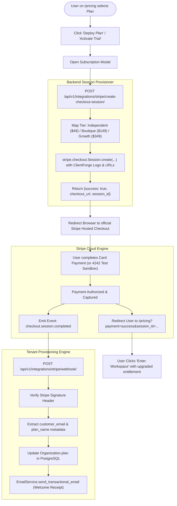
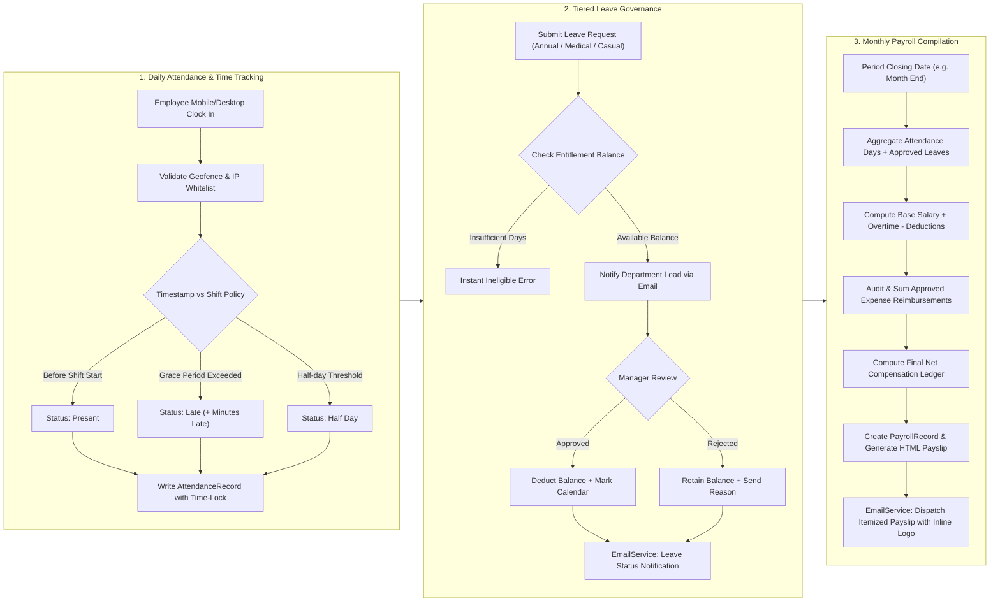

# ClientForge — Enterprise Workforce & Client Intelligence OS

<div align="center">


**High-certainty workforce orchestration, precision opportunity intelligence, and enterprise-grade multi-tenant operations.**

[](https://nextjs.org/)
[](https://react.dev/)
[](https://www.djangoproject.com/)
[](https://www.postgresql.org/)
[](https://stripe.com/)
[](https://firebase.google.com/)
[](https://www.typescriptlang.org/)
[](https://tailwindcss.com/)
[](#-license)

[System Architecture](#-master-system-architecture--flowcharts) • [Module Flowcharts](#-end-to-end-operational-flowcharts) • [Deep-Dive Backend Architecture](#-deep-dive-backend-system-architecture) • [Core Capabilities](#-core-capabilities) • [Quick Start](#-quick-start) • [Environment Variables](#-configuration)

</div>

---

## 🗺️ Master System Architecture & Flowcharts

### 1. High-Level Enterprise System Topology

The following diagram maps the entire distributed architecture across client applications, perimeter security, API gateways, core service domains, asynchronous background processing, database tiers, and third-party integrations:



---

## 🔄 End-to-End Operational Flowcharts

### 2. Dual Authentication & Session Lifecycle (Native JWT vs. Firebase Google SSO)



---

### 3. Stripe Subscription Checkout & Webhook Provisioning Flow



---

### 4. Enterprise Attendance, Leave Governance & Itemized Payroll Cycle



---

## 🏛️ Deep-Dive Backend System Architecture

ClientForge's backend is engineered to handle rigorous multi-tenant B2B SaaS demands, ensuring zero data leakage, continuous auditability, sub-100ms API response latency, and resilient third-party integrations.

### 1. Multi-Tenant Boundary Isolation & Organization Scoping
* **Contextual Request Hydration**: Every inbound HTTP request passes through `TenantContextMiddleware`. The middleware inspects `X-Organization-Id` headers or decoded JWT claims (`org_id`) to bind an immutable `request.organization` and `request.membership` context.
* **Declarative Manager Filters**: All tenant-scoped models inherit from a specialized `TenantManager` with default querysets restricted via `.filter(organization=request.organization)`. This guarantees that even accidental raw ORM queries cannot read or write data across organizational boundaries.
* **Role-Based Access Control (RBAC)**: Fine-grained permission classes (`IsTenantMember`, `IsTenantAdmin`, `IsTenantOwner`) govern operations across departments, salary figures, and audit findings, ensuring absolute least-privilege compliance.

### 2. Dual Cryptographic Authentication Engine
* **Stateless JWT Rotation**: Token pairs generated via Django REST Framework SimpleJWT implement short-lived access tokens (60 minutes) alongside sliding refresh tokens (7 days). Token blacklisting in Redis prevents replay attacks during logouts or privilege revocations.
* **Federated Google Identity Verification**: Firebase Web SDK signs Google OAuth payloads into cryptographic identity tokens. The backend validates token signatures in real-time via the Google Identity Public Key Set, extracting verified email claims, creating missing tenant profiles, and synchronizing user identities without passwords.
* **Two-Factor Authentication (2FA)**: Time-sensitive, 6-digit confirmation codes are dispatched via outbound transactional channels, enforcing two-step verification for sensitive operations like organization switching and administrative exports.

### 3. Asynchronous Job Queues & Resilient Email Transport
* **Worker Queue Architecture**: Celery 5.6 coupled with Redis 8 handles high-volume, non-blocking tasks including bulk payslip calculations, audit report exports, and transactional email distribution.
* **Inline MIME Email Composition**: To maximize inbox deliverability and prevent email clients (like Gmail or Apple Mail) from blocking branding assets, emails embed high-resolution PNG/JPEG logos as inline MIME attachments referenced through unique Content-IDs (`cid:clientforge_logo`), ensuring immediate visual fidelity without user prompts.
* **Transport Failover**: Built-in support for dual SMTP transports—primary production relays via Google Workspace SMTP (`smtp.gmail.com:587`) or custom infrastructure via Resend (`smtp.resend.com:587`) with automatic fallbacks and synchronous graceful degradation.

### 4. Billing, Checkout Sessions & Webhook Synchronization
* **Server-Side Session Minting**: Checkout sessions are minted server-side using Stripe's official SDK, preventing client-side parameter manipulation, tier spoofing, or pricing tampering.
* **Webhook Idempotency**: Stripe webhook endpoints verify HMAC SHA-256 signatures (`HTTP_STRIPE_SIGNATURE`) using a dedicated signing secret. Events like `checkout.session.completed` update tenant subscription tiers atomically inside database transactions.
* **Self-Contained Sandbox**: Supports full test-mode operation without requiring verified banking rails or regional merchant approvals, enabling frictionless local and staging development.

### 5. Compliance, Time-Locked Auditing & Document Vault
* **Immutable Audit Trail**: Any record creation, status update, download, or financial change records an audit entry with actor identity, source IP, user-agent, UTC timestamp, and JSON delta state.
* **AES-256 Document Vault**: Sensitive corporate documents (such as executive contracts, medical leaves, and payroll records) are stored with SHA-256 integrity checksums to detect file tampering.
* **Data Privacy Governance**: Pre-configured architectural compliance supporting SOC-2 Type II controls, ISO 27001 data isolation policies, and GDPR/CCPA data subject access workflows.

---

## 🌟 Core Capabilities

### 🏢 PeopleCore™ HR & Workforce OS
* **Full Lifecycle Employee Management**: Departments, designated job roles, automated compensation structures, and emergency contacts.
* **Smart Attendance & Real-Time Punch Clock**: GPS/IP-validated shifts, automated status calculation (`Present`, `Late`, `Half Day`, `Absent`), and team rosters.
* **Tiered Leave Governance**: Entitlement balance ledgers, single-click approvals, and employee self-service balances.
* **Payroll & Expense Reimbursement Engine**: Auto-computed net compensations, direct bank disbursements, and automated itemized payslip delivery.
* **Immutable Document Vault**: AES-256 encrypted storage with SHA-256 seal verification for contracts, medical leave slips, and compliance dossiers.

### 🛡️ Enterprise Security & Multi-Tenancy
* **Strict Tenant Context Isolation**: Middleware-enforced logical and physical tenant boundary isolation across all database operations.
* **Zero-Trust Audit Logs**: Cryptographically verifiable audit trail capturing actor, target UUID, IP address, user-agent, and before/after payloads.
* **Interactive Living Characters Auth**: Reactive, organic UI characters that track cursor interactions, huddle together, and bashfully cover their eyes during password entry.
* **Dual Authentication Modes**:
  * Native JWT with rotating refresh tokens and BCrypt password encryption.
  * Google One-Tap & Popup OAuth via Firebase Authentication.

### 📧 Transactional Email Engine
* Centralized delivery service with styled HTML templates, plain-text fallbacks, and embedded **inline CID branding**.
* Production-ready for Gmail SMTP Relay, Resend, SendGrid, or AWS SES.
* Automated dispatch for:
  * Team member workspace invitations with expiring single-use tokens.
  * One-click password resets and email account verification.
  * Leave approval/rejection notices.
  * Itemized monthly payslips.
  * SOC-2 & ISO-27001 Security & Compliance Dossiers.

---

## 🏗️ Architecture & Technology Matrix

| Layer | Technologies | Purpose |
| :--- | :--- | :--- |
| **Frontend Framework** | [Next.js 16 (Turbopack App Router)](https://nextjs.org/) | Server & Client Components, Dynamic Routes, Fast Refresh |
| **UI Library** | [React 19](https://react.dev/) | Concurrent UI features, actions, hooks |
| **Styling & Motion** | [Tailwind CSS v4](https://tailwindcss.com/), [Framer Motion](https://www.framer.com/motion) | Fluid luxury styling, 3D cards, character rigging |
| **Interactive 3D** | [Three.js](https://threejs.org/) | Spatial mesh particle field & depth backgrounds |
| **Backend Framework** | [Django 6.1](https://www.djangoproject.com/) / Python 3.13 | High-concurrency enterprise REST API |
| **API Architecture** | [Django REST Framework 3.18](https://www.django-rest-framework.org/) | REST serializers, viewsets, and granular permission gates |
| **Relational Database** | [PostgreSQL 16](https://www.postgresql.org/) | Multi-tenant relational schema, indexes, and transactions |
| **Cache & Tasks** | [Redis 8](https://redis.io/) & [Celery 5.6](https://docs.celeryq.dev/) | Asynchronous email queues, periodic scheduler, caching |
| **Payment Gateway** | [Stripe SDK 15.6](https://stripe.com/) | Hosted Checkout Sessions, Webhooks, Billing tiers |
| **Identity & Storage** | [Firebase Admin 7.7](https://firebase.google.com/) | Google OAuth verification & Cloud Storage buckets |
| **Email Relay** | Google SMTP Relay / Resend | High-deliverability transactional dispatch with inline CID |

---

## 📂 Project Structure

```text
Client Forge/
├── backend/                        # Django REST API Engine
│   ├── apps/
│   │   ├── accounts/               # Custom User, JWT Auth, Firebase SSO, Password Resets
│   │   ├── attendance/             # Daily Punch Clocks, Overtime, Shift Management
│   │   ├── audit/                  # Immutable Audit Trail & Telemetry
│   │   ├── documents/              # Encrypted Document Vault & Downloads
│   │   ├── employees/              # Staff Directory, Compensation, Emergency Contacts
│   │   ├── integrations/           # External Providers (Firebase, Stripe, Webhooks)
│   │   ├── leave/                  # Entitlements, Leave Requests, Approval Workflows
│   │   ├── notifications/          # Email Service, Base Templates, Diagnostic Commands
│   │   ├── operations/             # Candidates, Performance Goals, Workspace Bootstrap
│   │   ├── organizations/          # Multi-Tenant Isolation, Memberships, Departments
│   │   └── payroll/                # Salaries, Expense Approvals, Itemized Payslips
│   ├── core/                       # Settings, Middleware, URL Routing, Exceptions
│   ├── templates/emails/           # Responsive Transactional Email Templates
│   └── manage.py                   # Management Command CLI
├── frontend/                       # Next.js 16 Web Application
│   ├── app/                        # App Router Pages (Landing, Auth, Workspace, Pricing)
│   ├── components/                 # Living Characters, Navbar, Modals, 3D Canvas
│   ├── context/                    # Multi-Tenant Workspace & Auth Context
│   ├── lib/                        # API Client, Firebase Client, Seed Data
│   └── public/                     # Brand Assets, Logos, Vectors
├── docker-compose.yml              # Multi-Service Production Compose
└── README.md                       # Master Architecture Guide
```

---

## 🚀 Quick Start

### Prerequisites
* **Node.js** >= 20.x
* **Python** >= 3.11 (3.13 recommended)
* **PostgreSQL** >= 15
* **Redis** (optional for dev, required for Celery tasks)

---

### 1. Backend Setup

```bash
# Navigate to backend directory
cd backend

# Create and activate Python virtual environment
python -m venv venv
# On Windows:
.\venv\Scripts\activate
# On Linux/macOS:
source venv/bin/activate

# Install dependencies
pip install -r requirements.txt

# Run migrations
python manage.py migrate

# Seed baseline demonstration data
python manage.py seed_data

# Start development server
python manage.py runserver 127.0.0.1:8000
```

---

### 2. Frontend Setup

```bash
# Navigate to frontend directory in a separate terminal
cd frontend

# Install npm dependencies
npm install

# Start development server
npm run dev
```

Visit **[http://localhost:3000](http://localhost:3000)** in your browser to explore the platform.

---

## ⚙️ Configuration

### Backend (`backend/.env`)

```env
# Application Core
DJANGO_SECRET_KEY=your-secure-production-secret-key
DJANGO_DEBUG=True
DJANGO_ALLOWED_HOSTS=localhost,127.0.0.1,0.0.0.0

# Database (PostgreSQL)
DB_NAME=client_forge
DB_USER=postgres
DB_PASSWORD=your_password
DB_HOST=127.0.0.1
DB_PORT=5432

# Redis & Queues
REDIS_URL=redis://127.0.0.1:6379/0
CELERY_BROKER_URL=redis://127.0.0.1:6379/0

# Stripe Payments (Sandbox)
STRIPE_SECRET_KEY=sk_test_...
STRIPE_PUBLISHABLE_KEY=pk_test_...
STRIPE_WEBHOOK_SECRET=whsec_...

# Authentication & Firebase
FIREBASE_CREDENTIALS_PATH=firebase-service-account.json
FIREBASE_STORAGE_BUCKET=your-app.firebasestorage.app

# Email Delivery (Gmail SMTP or Resend)
DJANGO_EMAIL_BACKEND=django.core.mail.backends.smtp.EmailBackend
EMAIL_HOST=smtp.gmail.com
EMAIL_PORT=587
EMAIL_USE_TLS=True
EMAIL_HOST_USER=your_email@gmail.com
EMAIL_HOST_PASSWORD=your_app_password
DEFAULT_FROM_EMAIL=ClientForge <your_email@gmail.com>

# Frontend Origin
FRONTEND_URL=http://localhost:3000
```

### Frontend (`frontend/.env.local`)

```env
NEXT_PUBLIC_API_URL=http://127.0.0.1:8000/api/v1
NEXT_PUBLIC_FIREBASE_API_KEY=your-firebase-web-api-key
NEXT_PUBLIC_FIREBASE_AUTH_DOMAIN=your-app.firebaseapp.com
NEXT_PUBLIC_FIREBASE_PROJECT_ID=your-project-id
NEXT_PUBLIC_FIREBASE_STORAGE_BUCKET=your-app.firebasestorage.app
NEXT_PUBLIC_FIREBASE_MESSAGING_SENDER_ID=your-sender-id
NEXT_PUBLIC_FIREBASE_APP_ID=your-app-id
NEXT_PUBLIC_STRIPE_PUBLISHABLE_KEY=pk_test_...
```

---

## 🧪 Testing & Diagnostics

### Run Full Test Suite (71 Unit & Integration Tests)
```bash
python manage.py test
```

### Test Outbound Email Dispatch
```bash
python manage.py test_email --to recipient@example.com
```

### Verify System Health
```bash
curl http://127.0.0.1:8000/api/v1/health/
```

---

## 📄 License
Proprietary & Confidential. All rights reserved. © 2026 Client Forge Systems, Inc.
