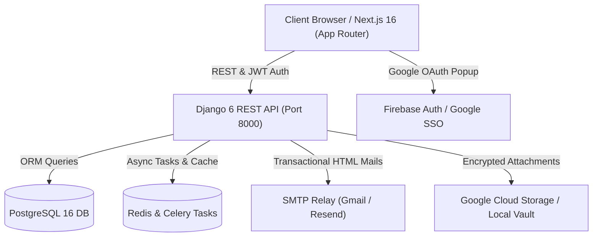

# ClientForge — Enterprise Workforce & Client Intelligence OS

<div align="center">


**High-certainty workforce orchestration, precision opportunity intelligence, and enterprise-grade multi-tenant operations.**

[](https://nextjs.org/)
[](https://react.dev/)
[](https://www.djangoproject.com/)
[](https://www.postgresql.org/)
[](https://www.typescriptlang.org/)
[](https://tailwindcss.com/)
[](#-license)

[Features](#-core-capabilities) • [Architecture](#-architecture--stack) • [Quick Start](#-quick-start) • [Environment Variables](#-configuration) • [API Overview](#-backend-api-architecture)

</div>

---

## 🌟 Core Capabilities

### 🏢 PeopleCore™ HR & Workforce OS
* **Full Lifecycle Employee Management**: Departments, designated job roles, automated compensation structures, and emergency contacts.
* **Smart Attendance & Real-Time Punch Clock**: GPS/IP-validated shifts, automated status calculation (`Present`, `Late`, `Half Day`, `Absent`), and team rosters.
* **Tiered Leave Governance**: Entitlement balance ledgers, single-click approvals, and employee self-service balances.
* **Payroll & Expense Reimbursement Engine**: Auto-computed net compensations, direct bank disbursements, and automated itemized payslip delivery.
* **Immutable Document Vault**: AES-256 encrypted storage with SHA-256 seal verification for contracts, medical leave slips, and compliance dossiers.

### 🛡️ Enterprise Security & Multi-Tenancy
* **Strict Tenant Context Isolation**: Middleware-enforced logical and physical tenant boundary isolation across all database operations.
* **Zero-Trust Audit Logs**: Cryptographically verifiable audit trail capturing actor, target UUID, IP address, user-agent, and before/after payloads.
* **Interactive Living Characters Auth**: Reactive, organic UI characters that track cursor interactions, huddle together, and bashfully cover their eyes during password entry.
* **Dual Authentication Modes**:
  * Native JWT with rotating refresh tokens and BCrypt password encryption.
  * Google One-Tap & Popup OAuth via Firebase Authentication.

### 📧 Transactional Email Engine
* Centralized delivery service with styled HTML templates, plain-text fallbacks, and embedded **inline CID branding**.
* Production-ready for Gmail SMTP Relay, Resend, SendGrid, or AWS SES.
* Automated dispatch for:
  * Team member workspace invitations with expiring single-use tokens.
  * One-click password resets and email account verification.
  * Leave approval/rejection notices.
  * Itemized monthly payslips.
  * SOC-2 & ISO-27001 Security & Compliance Dossiers.

---

## 🏗️ Architecture & Stack



### Technology Matrix
| Layer | Technologies |
| :--- | :--- |
| **Frontend** | Next.js 16 (Turbopack), React 19, TypeScript, Tailwind CSS v4, Framer Motion, Lucide Icons, Three.js |
| **Backend** | Python 3.13, Django 6.1, Django REST Framework 3.18, SimpleJWT |
| **Database** | PostgreSQL 16 with optimized connection pooling |
| **Caching & Queues**| Redis 8, Celery 5.6 |
| **Cloud & Auth** | Firebase Admin SDK 7.7, Google Identity Toolkit, Resend / Gmail SMTP |

---

## 📂 Project Structure

```text
Client Forge/
├── backend/                        # Django REST API Engine
│   ├── apps/
│   │   ├── accounts/               # Custom User, JWT Auth, Firebase SSO, Password Resets
│   │   ├── attendance/             # Daily Punch Clocks, Overtime, Shift Management
│   │   ├── audit/                  # Immutable Audit Trail & Telemetry
│   │   ├── documents/              # Encrypted Document Vault & Downloads
│   │   ├── employees/              # Staff Directory, Compensation, Emergency Contacts
│   │   ├── integrations/           # External Providers (Firebase, Stripe, Webhooks)
│   │   ├── leave/                  # Entitlements, Leave Requests, Approval Workflows
│   │   ├── notifications/          # Email Service, Base Templates, Diagnostic Commands
│   │   ├── operations/             # Candidates, Performance Goals, Workspace Bootstrap
│   │   ├── organizations/          # Multi-Tenant Isolation, Memberships, Departments
│   │   └── payroll/                # Salaries, Expense Approvals, Itemized Payslips
│   ├── core/                       # Settings, Middleware, URL Routing, Exceptions
│   ├── templates/emails/           # Responsive Transactional Email Templates
│   └── manage.py                   # Management Command CLI
├── frontend/                       # Next.js 16 Web Application
│   ├── app/                        # App Router Pages (Landing, Auth, Workspace, Pricing)
│   ├── components/                 # Living Characters, Navbar, Modals, 3D Canvas
│   ├── context/                    # Multi-Tenant Workspace & Auth Context
│   ├── lib/                        # API Client, Firebase Client, Seed Data
│   └── public/                     # Brand Assets, Logos, Vectors
├── docker-compose.yml              # Multi-Service Production Compose
└── README.md                       # Master Architecture Guide
```

---

## 🚀 Quick Start

### Prerequisites
* **Node.js** >= 20.x
* **Python** >= 3.11 (3.13 recommended)
* **PostgreSQL** >= 15
* **Redis** (optional for dev, required for Celery tasks)

---

### 1. Backend Setup

```bash
# Navigate to backend directory
cd backend

# Create and activate Python virtual environment
python -m venv venv
# On Windows:
.\venv\Scripts\activate
# On Linux/macOS:
source venv/bin/activate

# Install dependencies
pip install -r requirements.txt

# Run migrations
python manage.py migrate

# Seed baseline demonstration data
python manage.py seed_data

# Start development server
python manage.py runserver 127.0.0.1:8000
```

---

### 2. Frontend Setup

```bash
# Navigate to frontend directory in a separate terminal
cd frontend

# Install npm dependencies
npm install

# Start development server
npm run dev
```

Visit **[http://localhost:3000](http://localhost:3000)** in your browser to explore the platform.

---

## ⚙️ Configuration

### Backend (`backend/.env`)

```env
# Application Core
DJANGO_SECRET_KEY=your-secure-production-secret-key
DJANGO_DEBUG=True
DJANGO_ALLOWED_HOSTS=localhost,127.0.0.1,0.0.0.0

# Database (PostgreSQL)
DB_NAME=client_forge
DB_USER=postgres
DB_PASSWORD=your_password
DB_HOST=127.0.0.1
DB_PORT=5432

# Redis & Queues
REDIS_URL=redis://127.0.0.1:6379/0
CELERY_BROKER_URL=redis://127.0.0.1:6379/0

# Authentication & Firebase
FIREBASE_CREDENTIALS_PATH=firebase-service-account.json
FIREBASE_STORAGE_BUCKET=your-app.firebasestorage.app

# Email Delivery (Gmail SMTP or Resend)
DJANGO_EMAIL_BACKEND=django.core.mail.backends.smtp.EmailBackend
EMAIL_HOST=smtp.gmail.com
EMAIL_PORT=587
EMAIL_USE_TLS=True
EMAIL_HOST_USER=your_email@gmail.com
EMAIL_HOST_PASSWORD=your_app_password
DEFAULT_FROM_EMAIL=ClientForge <your_email@gmail.com>

# Frontend Origin
FRONTEND_URL=http://localhost:3000
```

### Frontend (`frontend/.env.local`)

```env
NEXT_PUBLIC_API_URL=http://127.0.0.1:8000/api/v1
NEXT_PUBLIC_FIREBASE_API_KEY=your-firebase-web-api-key
NEXT_PUBLIC_FIREBASE_AUTH_DOMAIN=your-app.firebaseapp.com
NEXT_PUBLIC_FIREBASE_PROJECT_ID=your-project-id
NEXT_PUBLIC_FIREBASE_STORAGE_BUCKET=your-app.firebasestorage.app
NEXT_PUBLIC_FIREBASE_MESSAGING_SENDER_ID=your-sender-id
NEXT_PUBLIC_FIREBASE_APP_ID=your-app-id
```

---

## 🧪 Testing & Diagnostics

### Run Backend Test Suite (69 Unit & Integration Tests)
```bash
python manage.py test
```

### Test Outbound Email Dispatch
```bash
python manage.py test_email --to recipient@example.com
```

### Verify System Health
```bash
curl http://127.0.0.1:8000/api/v1/health/
```

---

## 📄 License
Proprietary & Confidential. All rights reserved. © 2026 Client Forge Systems, Inc.
